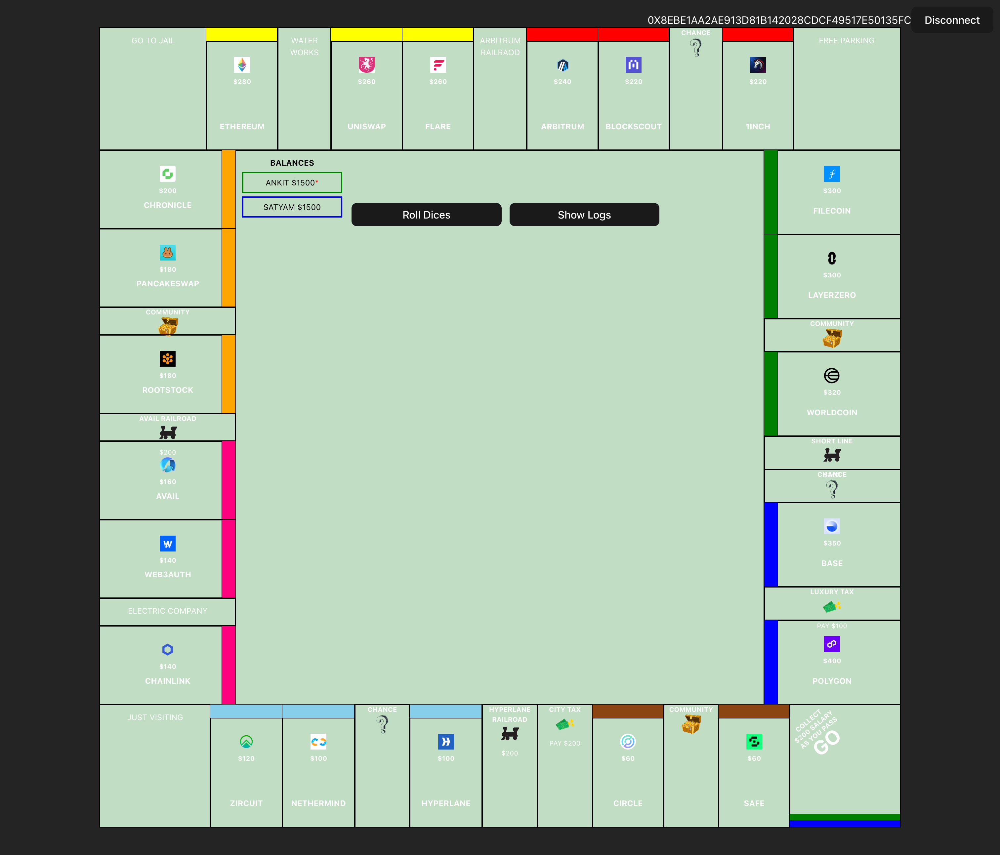

# Crypto-Cartels


## 📜 Introduction

Welcome to **Crypto-Cartels**, a groundbreaking project that explores the dynamics of monopolies within the blockchain ecosystem. Our goal is to shed light on how power and control can be consolidated in decentralized networks, and how this affects the broader crypto landscape.

## 🎯 Objectives

- **Educate** users about the concept of monopolies in blockchain.
- **Develop** tools and metrics to measure and visualize the level of centralization in different crypto ecosystems.

## 🔍 What is a Monopoly in Blockchain?

In traditional economics, a monopoly occurs when a single entity dominates a market, stifling competition and innovation. In the blockchain world, a monopoly can emerge when:

- A single mining pool controls a majority of the network's hash rate.
- A few entities hold a significant portion of a cryptocurrency's total supply.
- Development and decision-making are centralized within a small group.



## 🚀 Our Vision

At Crypto-Cartels, we believe in the original vision of blockchain: a decentralized, transparent, and fair system for everyone. Our mission is to identify, expose, and mitigate monopolistic tendencies in blockchain networks to ensure they remain true to these principles.


## 🌟 Why Crypto-Cartels?

- **Transparency**: We believe in open and transparent analysis.
- **Community-Driven**: Engage with the community to gather insights and foster collaboration.
- **Innovative Tools**: Cutting-edge tools to analyze and visualize blockchain data.

## 📈 Roadmap

1. **Phase 1**: Research and Development
   - Conduct in-depth research on blockchain monopolies.
   - Develop initial analysis tools.

2. **Phase 2**: Beta Launch
   - Release beta version of the Centralization Dashboard.
   - Gather user feedback and improve features.

3. **Phase 3**: Full Launch
   - Launch full version with advanced analytics and educational resources.
   - Expand to cover more blockchain networks.

### Running this example

To run the provided example, you can use `bun run dev` command.

```bash
bun install
bun run dev
```